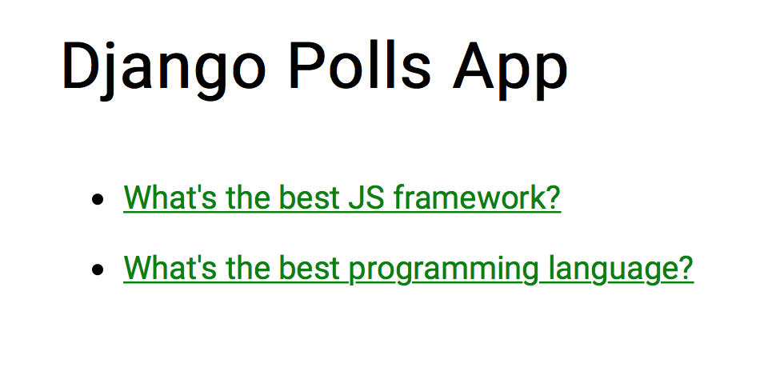

# Django Polls App

## Co to je

Jedná se o ukázkovou aplikaci zpracovanou podle tutoriálu https://docs.djangoproject.com/en/1.11/intro/tutorial01/. Databáze je přiložena, takže se o ni nemusíme nijak starat :-) V aplikaci můžeme odpovědět na dvě jednoduché otázky a udržovat si statistiku odpovědí. V administrátorském rozhraní je možné taky otázky přidávat nebo upravovat.

## Jak zprovoznit
0. Nainstaluj si Python, vytvoř virtuální prostředí a aktivuj ho ([návod](http://naucse.python.cz/2017/pyladies-praha-podzim-cznic/beginners/install/)), nainstaluj si git ([návod](http://naucse.python.cz/2017/pyladies-praha-podzim-cznic/git/install/))
1. Nainstaluj si Django; většinou by mělo zadat do příkazové řádky ```pip install Django``` (pokud by to nešlo, je tu i [komplexnější návod](https://docs.djangoproject.com/en/1.11/topics/install/))
2. Naklonuj (```git clone https://github.com/pyvec/pyworking-materials.git```, případně si [stáhni]((https://github.com/pyvec/pyworking-materials/tree/master/171014_Django-vue.js)) tento repozitář.
3. Ve složce ```django-polls-app``` napiš příkaz ```python manage.py runserver```
4. Na adrese http://127.0.0.1:8000/polls by mělo být vidět 
